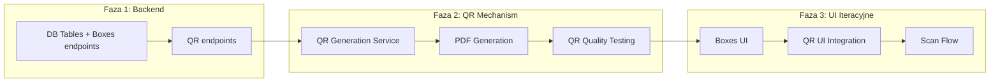

# Plan wdrożenia mechanizmu generowania kodów QR

**Overview:** Mechanizm generowania kodów QR powinien być przygotowany PO endpointach boxes, ale PRZED rozpoczęciem prac nad UI. Pozwoli to na izolowane testowanie jakości kodów i PDF, a przy iteracyjnym budowaniu UI - komponent będzie gotowy do integracji.

## Rekomendowana kolejność prac



---

## Faza 1: Backend (dzisiaj)

### 1.1 Tabele i endpointy boxes (zgodnie z planem)

- `POST /boxes`, `GET /boxes`, `GET /boxes/:id`, `PATCH /boxes/:id`, `DELETE /boxes/:id`

### 1.2 Endpointy QR (zaraz po boxes)

- `POST /qr-codes/batch` - batch generation
- `GET /qr-codes/:short_id` - lookup dla skanowania

---

## Faza 2: Mechanizm QR (PRZED UI)

### Rekomendacja: Generowanie PDF po stronie klienta

**Dlaczego:**

- Prostsze wdrożenie dla MVP
- Brak potrzeby Supabase Storage
- Mniejsza złożoność infrastruktury
- Użytkownik i tak pobiera PDF lokalnie

**Stack:**

- `react-qr-code` - renderowanie kodów QR (już w [tech-stack.md](/.ai_docs/tech-stack.md))
- `jspdf` - generowanie PDF w przeglądarce
- `html2canvas` (opcjonalnie) - renderowanie etykiet do canvas

### 2.1 QR Service (`src/lib/services/qr.service.ts`)

```typescript
// Generowanie danych dla batch QR
interface QRCodeData {
  id: string;
  shortId: string; // format: QR-XXXXXX
  url: string; // https://app.domain.com/qr/QR-XXXXXX
}

// Funkcje:
// - generateBatchQRCodes(workspaceId, quantity) - wywołuje endpoint
// - getQRCodeUrl(shortId) - generuje pełny URL
```

### 2.2 QR Label Component (`src/components/qr/QRLabel.tsx`)

Pojedyncza etykieta zawierająca:

- Kod QR (128x128px minimum dla dobrej czytelności)
- Short ID tekstowy (np. `QR-A1B2C3`)
- Opcjonalnie: miejsce na ręczny opis

### 2.3 PDF Generator (`src/lib/utils/pdf-generator.ts`)

```typescript
// Generowanie arkusza A4 z siatką etykiet
// - 4 kolumny x 5 wierszy = 20 etykiet na stronę
// - Rozmiar etykiety: ~50x50mm
// - Marginesy do cięcia
```

### 2.4 Testowanie jakości (KRYTYCZNE)

**Przed przejściem do UI należy zwalidować:**

1. Czytelność kodów QR przy różnych rozmiarach
2. Skanowanie telefonem (iPhone, Android)
3. Jakość wydruku na drukarce domowej
4. Poprawność URL-i po skanowaniu

---

## Faza 3: UI Iteracyjne

Kolejność komponentów:

1. Lista boxes z wyszukiwarką
2. Formularz tworzenia box
3. Widok szczegółów box
4. **Komponent generowania QR/PDF** - integracja gotowego mechanizmu
5. Strona `/qr/:shortId` - routing po skanowaniu (empty state vs box details)

---

## Dlaczego QR przed UI?

| Aspekt               | QR przed UI   | QR w trakcie UI |
| -------------------- | ------------- | --------------- |
| Izolowane testowanie | Tak           | Nie             |
| Walidacja wydruku    | Wcześnie      | Późno           |
| Ryzyko opóźnień      | Niskie        | Wysokie         |
| Jakość kodów         | Zweryfikowana | Niepewna        |

**Kluczowy argument:** Jeśli kody QR będą nieczytelne lub PDF źle sformatowany - dowiesz się o tym wcześnie, nie podczas integracji z UI.

---

## Szacowany czas

| Zadanie                         | Czas      |
| ------------------------------- | --------- |
| QR endpoints                    | 2-3h      |
| QR Service + Label Component    | 2-3h      |
| PDF Generator                   | 3-4h      |
| Testowanie jakości (druk, skan) | 1-2h      |
| **Łącznie przed UI**            | **8-12h** |

---

## Pliki do utworzenia

```
src/
├── lib/
│   ├── services/
│   │   └── qr.service.ts          # API calls dla QR
│   └── utils/
│       └── pdf-generator.ts       # Generowanie PDF
├── components/
│   └── qr/
│       ├── QRLabel.tsx            # Pojedyncza etykieta
│       ├── QRSheet.tsx            # Arkusz do podglądu
│       └── QRGeneratorDialog.tsx  # Dialog generowania (UI)
└── pages/
    ├── api/
    │   └── qr-codes/
    │       ├── batch.ts           # POST endpoint
    │       └── [short_id].ts      # GET endpoint
    └── qr/
        └── [short_id].astro       # Strona po skanowaniu
```

---

## TODO Lista

- [ ] Implementacja endpointów QR: POST /qr-codes/batch i GET /qr-codes/:short_id
- [ ] Stworzenie QR Service do komunikacji z API i generowania URL-i
- [ ] Komponent QRLabel.tsx - pojedyncza etykieta z kodem QR i short_id
- [ ] Utility pdf-generator.ts - generowanie arkuszy A4 z siatką etykiet (jspdf)
- [ ] Testowanie jakości: wydruk, skanowanie telefonem, czytelność kodów
- [ ] Strona /qr/:short_id - routing po skanowaniu (empty state vs box details)
