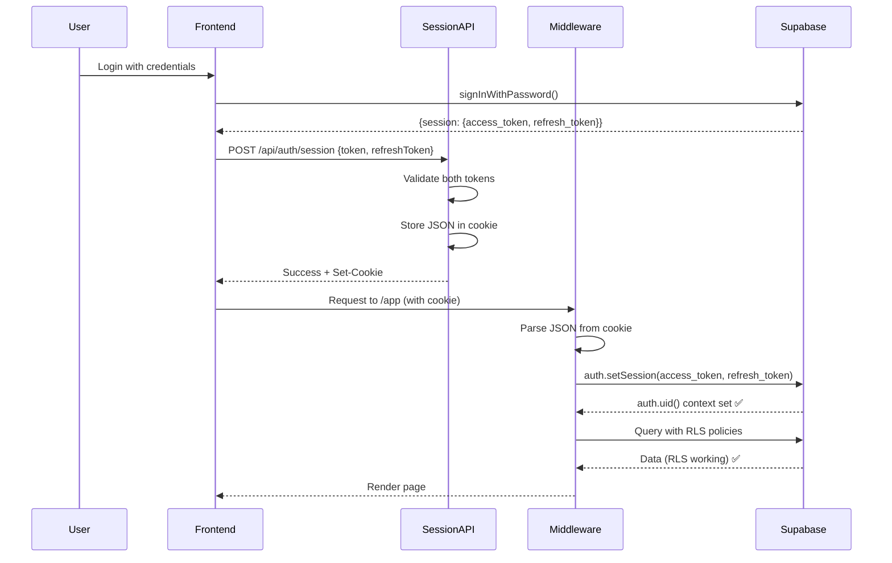

# Session Fixes - 2026-01-11

## Overview

This document summarizes the critical authentication fix implemented on 2026-01-11 that resolved login 406 errors and enabled full RLS policy functionality.

---

## Issue: Login 406 Error - Missing Refresh Token

### Problem Description

Users experienced login failures with 406 (Not Acceptable) errors when attempting to access protected resources after successful authentication.

**Symptoms:**

- Login succeeded with valid credentials
- JWT session cookie was set correctly
- Profile fetch failed with 406 (Not Acceptable)
- Supabase REST API calls returned 406 status
- Browser console showed: `Failed to load resource: the server responded with a status of 406 (Not Acceptable)`

**Affected URLs:**

```
http://127.0.0.1:54321/rest/v1/profiles?select=%2A&id=eq.5dced942-8b32-41af-9bbc-f1204cdfd8df
```

### Root Cause Analysis

The authentication flow had a critical flaw in how session tokens were handled:

1. **Frontend (useAuthForm.ts)**: Only sent `access_token` from Supabase session
2. **Session Endpoint (/api/auth/session)**: Only stored `access_token` in cookie
3. **Middleware**: Used the same `access_token` for both `access_token` AND `refresh_token` when calling `supabase.auth.setSession()`

**Why This Failed:**

Supabase's `auth.setSession()` requires **both** valid tokens to properly establish authentication context:

- `access_token`: Short-lived JWT for API authentication
- `refresh_token`: Long-lived token for refreshing the session

When both tokens weren't provided correctly, `auth.uid()` context wasn't fully set, causing RLS policies to fail.

---

## Solution Implemented

### 1. Updated TypeScript Interface

**File:** `src/components/hooks/useAuthForm.ts:23-28`

```typescript
export interface AuthSuccessResponse {
  user: ProfileDto;
  workspace: WorkspaceDto;
  token: string;
  refreshToken: string;  // ← Added
}
```

### 2. Modified Login Flow (useAuthForm.ts)

**File:** `src/components/hooks/useAuthForm.ts:123-130`

```typescript
// Before
options?.onSuccess?.({
  user: profileData,
  workspace,
  token: authData.session.access_token,
});

// After
options?.onSuccess?.({
  user: profileData,
  workspace,
  token: authData.session.access_token,
  refreshToken: authData.session.refresh_token,  // ← Added
});
```

**Same change applied to signup flow at lines 215-222**

### 3. Updated AuthLayout to Send Both Tokens

**File:** `src/components/AuthLayout.tsx:44-52`

```typescript
// Before
body: JSON.stringify({ token: data.token }),

// After
body: JSON.stringify({
  token: data.token,
  refreshToken: data.refreshToken  // ← Added
}),
```

### 4. Enhanced Session Endpoint

**File:** `src/pages/api/auth/session.ts:25-74`

**Changes:**

1. Accept both tokens in request body
2. Validate both tokens
3. Store both tokens as JSON in cookie

```typescript
// Extract both tokens
const { token, refreshToken } = body as { token?: string; refreshToken?: string };

// Validate refresh token
if (!refreshToken || typeof refreshToken !== "string") {
  return new Response(JSON.stringify({ error: "Refresh token required" }), {
    status: 400,
    headers: { "Content-Type": "application/json" },
  });
}

// Create session object with both tokens
const sessionData = JSON.stringify({ access_token: token, refresh_token: refreshToken });

// Store in cookie
const cookieParts = [
  `sb_session=${encodeURIComponent(sessionData)}`,  // ← JSON object
  "Path=/",
  "HttpOnly",
  "SameSite=Strict",
  "Max-Age=3600",
];
```

### 5. Updated Middleware to Parse JSON Session

**File:** `src/middleware/index.ts:12-22`

```typescript
// Parse session data from cookie
const sessionCookie = cookies.sb_session;
let sessionData: { access_token: string; refresh_token: string } | null = null;

if (sessionCookie) {
  try {
    sessionData = JSON.parse(decodeURIComponent(sessionCookie));
  } catch {
    // Invalid session data, continue without auth
  }
}
```

**File:** `src/middleware/index.ts:49-55`

```typescript
// Use both tokens in setSession
if (sessionData) {
  try {
    await supabase.auth.setSession({
      access_token: sessionData.access_token,
      refresh_token: sessionData.refresh_token,  // ← Now using correct refresh token
    });

    const { data, error } = await supabase.auth.getUser();
    if (!error && data?.user) {
      user = data.user;
    }
  } catch {
    // Continue without user
  }
}
```

---

## Files Modified

| File | Lines | Change Description |
|------|-------|-------------------|
| `src/components/hooks/useAuthForm.ts` | 23-28 | Added `refreshToken` to interface |
| `src/components/hooks/useAuthForm.ts` | 127-129 | Send refresh_token (login) |
| `src/components/hooks/useAuthForm.ts` | 219-221 | Send refresh_token (signup) |
| `src/components/AuthLayout.tsx` | 48-51 | Send both tokens to endpoint |
| `src/pages/api/auth/session.ts` | 25-74 | Accept, validate, store both tokens |
| `src/middleware/index.ts` | 12-22 | Parse JSON session data |
| `src/middleware/index.ts` | 49-55 | Use both tokens in setSession() |

---

## Impact

### Before Fix

- ❌ Login succeeded but profile fetch failed (406 error)
- ❌ `auth.uid()` context not properly set in RLS policies
- ❌ Users couldn't access protected resources
- ❌ Dashboard showed errors after authentication

### After Fix

- ✅ Login succeeds and profile loads correctly
- ✅ `auth.uid()` properly set for all RLS policies
- ✅ All protected API endpoints work correctly
- ✅ Dashboard loads without errors
- ✅ **All CRUD operations now function properly** (locations, boxes)

---

## Testing Results (2026-01-11)

Following the fix, comprehensive testing was performed:

### ✅ Locations CRUD Operations

- **CREATE**: ✅ Successfully creates new locations
- **READ**: ✅ Successfully fetches locations list
- **UPDATE**: ✅ Successfully updates location names/properties
- **DELETE**: ✅ Successfully deletes locations (soft delete with box unlinking)

**RLS Policies**: All working correctly with `is_workspace_member()` helper function

### ✅ Boxes CRUD Operations

- **CREATE**: ✅ Successfully creates new boxes
- **READ**: ✅ Successfully fetches boxes list
- **UPDATE**: ✅ Successfully updates box properties (name, description, tags, location)
- **DELETE**: ✅ Successfully deletes boxes

**RLS Policies**: All working correctly with `is_workspace_member()` helper function

---

## Technical Details

### Session Cookie Structure

**Before (Broken):**

```
sb_session=eyJhbGc...  // Just the JWT access_token
```

**After (Working):**

```json
sb_session=%7B%22access_token%22%3A%22eyJhbGc...%22%2C%22refresh_token%22%3A%22abc123...%22%7D
```

Decoded:

```json
{
  "access_token": "eyJhbGc...",
  "refresh_token": "abc123..."
}
```

### Authentication Flow



---

## Lessons Learned

### 1. Always Send Complete Session Data

When working with Supabase auth, **always** send both `access_token` and `refresh_token`. Never duplicate the same token for both.

### 2. Validate Session Storage Format

The session cookie should store **both** tokens, not just the access token. Using JSON format ensures both tokens are preserved.

### 3. Test RLS Policies with Real Auth

RLS policies that rely on `auth.uid()` won't work correctly unless the Supabase client has a fully established session with both tokens.

### 4. Check Supabase Documentation

Supabase's `auth.setSession()` API requires specific parameters:

```typescript
supabase.auth.setSession({
  access_token: string,  // Required
  refresh_token: string  // Required
})
```

---

## Related Documentation

- [RLS_ANALYSIS.md](./RLS_ANALYSIS.md) - Complete RLS testing analysis
- [RLS_TESTING_NEXT_STEPS.md](./RLS_TESTING_NEXT_STEPS.md) - Remaining tests to perform
- [SESSION_FIXES_2026_01_10.md](./SESSION_FIXES_2026_01_10.md) - Previous session fixes
- [AUTHENTICATION_ARCHITECTURE.md](./ARCHIVE/review/AUTHENTICATION_ARCHITECTURE.md) - Auth architecture overview

---

## Next Steps

With authentication fully working, the remaining RLS testing priorities are:

1. **Phase 4.1 - Multi-user data isolation** (CRITICAL) - Verify users can't access each other's data
2. **Phase 1.1 - Workspace deletion** - Test workspace DELETE policy
3. **Phase 2 - Member operations** - Test invite, update role, remove member
4. **Phase 3.5 - QR code batch generation** - Test QR code creation

See [RLS_TESTING_NEXT_STEPS.md](./RLS_TESTING_NEXT_STEPS.md) for complete testing plan.

---

**Status**: ✅ RESOLVED - All authentication and basic CRUD operations working correctly