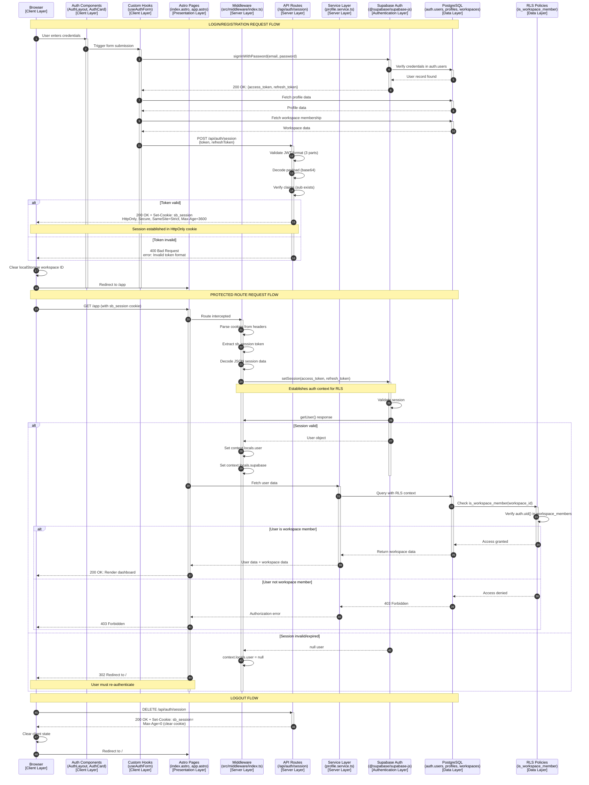
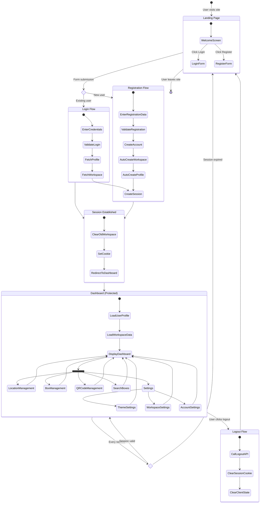

# Authentication System Specification

**Last Updated:** January 11, 2026
**Status:** Production Active
**Security Level:** OWASP Top 10 Compliant

---

## Table of Contents

1. [Overview](#overview)
2. [Architecture](#architecture)
3. [Authentication Flow](#authentication-flow)
4. [Security Features](#security-features)
5. [Session Management](#session-management)
6. [User Journey](#user-journey)
7. [API Endpoints](#api-endpoints)
8. [Database Integration](#database-integration)
9. [Error Handling](#error-handling)
10. [Testing Guidelines](#testing-guidelines)

---

## Overview

The Storage & Box Organizer application implements a **secure HttpOnly cookie-based authentication system** using Supabase Auth as the identity provider. This architecture provides protection against XSS (Cross-Site Scripting) and CSRF (Cross-Site Request Forgery) attacks while maintaining seamless user experience.

### Key Characteristics

- **Authentication Provider:** Supabase Auth
- **Session Storage:** HttpOnly cookies (JWT tokens never exposed to JavaScript)
- **Token Transmission:** Request body only (never in URLs or headers)
- **Session Duration:** 1 hour (3600 seconds)
- **CSRF Protection:** SameSite=Strict cookie policy
- **Multi-Workspace:** Automatic workspace creation on registration

---

## Architecture

### System Components Architecture



### Layer Responsibilities

| Layer | Components | Responsibilities | Error Handling |
|-------|------------|------------------|----------------|
| **Client Layer** | React Components, Hooks | User input, form validation, state management | Display user-friendly errors |
| **Presentation Layer** | Astro Pages | Route protection, SSR rendering | Redirect on auth failure |
| **Server Layer** | Middleware, API Routes, Services | Session validation, business logic | Return HTTP status codes |
| **Authentication Layer** | Supabase Auth | Identity verification, token generation | Auth errors (401, 403) |
| **Data Layer** | PostgreSQL, RLS | Data persistence, access control | Database errors (500) |

### Technology Stack

- **Frontend:** React 19 + Astro 5
- **State Management:** React hooks (useState, useCallback)
- **HTTP Client:** Fetch API with credentials: 'include'
- **Authentication:** Supabase Auth (@supabase/supabase-js)
- **Session Parser:** cookie package (Node.js)
- **Database:** PostgreSQL with Row Level Security (RLS)

---

## Authentication Flow

### Login/Registration Sequence Diagram

```mermaid
sequenceDiagram
    autonumber
    participant Browser
    participant AuthLayout
    participant Supabase
    participant SessionAPI
    participant Middleware
    participant Database

    Browser->>AuthLayout: User enters credentials
    activate AuthLayout

    AuthLayout->>Supabase: signInWithPassword()
    activate Supabase

    Supabase->>Database: Validate credentials
    activate Database
    Database-->>Supabase: User validated
    deactivate Database

    Supabase-->>AuthLayout: Return tokens (access + refresh)
    deactivate Supabase

    AuthLayout->>Database: Fetch user profile
    activate Database
    Database-->>AuthLayout: Profile data
    deactivate Database

    AuthLayout->>Database: Fetch workspace membership
    Database-->>AuthLayout: Workspace data
    deactivate Database

    AuthLayout->>SessionAPI: POST /api/auth/session
    Note over AuthLayout,SessionAPI: Tokens sent in request body (secure)
    activate SessionAPI

    SessionAPI->>SessionAPI: Validate JWT format
    SessionAPI->>SessionAPI: Decode token payload
    SessionAPI->>SessionAPI: Create session object

    SessionAPI-->>Browser: Set HttpOnly cookie (sb_session)
    Note over SessionAPI,Browser: Cookie: HttpOnly, Secure, SameSite=Strict
    deactivate SessionAPI

    Browser->>Browser: Clear workspace localStorage
    Note over Browser: Prevents 403 errors from old workspace IDs

    Browser->>Browser: Redirect to /app
    deactivate AuthLayout

    Browser->>Middleware: GET /app (with sb_session cookie)
    activate Middleware

    Middleware->>Middleware: Parse cookies from headers
    Middleware->>Middleware: Extract sb_session token
    Middleware->>Middleware: Decode JSON session data

    Middleware->>Supabase: setSession(access_token, refresh_token)
    activate Supabase
    Note over Middleware,Supabase: Enables auth.uid() for RLS policies

    Supabase->>Supabase: Validate session
    Supabase-->>Middleware: User object
    deactivate Supabase

    Middleware->>Middleware: Set context.locals.user
    Middleware->>Middleware: Set context.locals.supabase

    Middleware-->>Browser: Render /app page
    deactivate Middleware
```

### Registration Flow Specifics

**Automatic Workspace Creation:**
- When a new user registers, the database trigger `handle_new_user()` automatically:
  1. Creates a profile record in `profiles` table
  2. Creates a default workspace named "My Workspace"
  3. Adds user as workspace member with `owner` role
  4. All within a single transaction

**Post-Registration Steps:**
```typescript
// 1. User signs up via Supabase
const { data } = await supabase.auth.signUp({ email, password });

// 2. Fetch auto-created profile (via trigger)
const profile = await supabase.from('profiles').select('*').eq('id', user.id).single();

// 3. Fetch auto-created workspace (via trigger)
const workspace = await supabase
  .from('workspace_members')
  .select('workspaces!inner(*)')
  .eq('user_id', user.id)
  .single();

// 4. Establish session with tokens
onSuccess({ user: profile, workspace, token, refreshToken });
```

---

## Security Features

### 1. HttpOnly Cookie Protection

**Cookie Configuration:**
```typescript
const cookieParts = [
  `sb_session=${encodeURIComponent(sessionData)}`,
  "Path=/",                    // Available to all routes
  "HttpOnly",                  // JavaScript cannot access
  "SameSite=Strict",          // CSRF protection
  "Max-Age=3600",             // 1 hour expiration
  isProduction ? "Secure" : "" // HTTPS only in production
];
```

**Security Benefits:**
- ✅ **XSS Protection:** JavaScript cannot read the cookie
- ✅ **CSRF Protection:** SameSite=Strict prevents cross-origin requests
- ✅ **Transport Security:** Secure flag ensures HTTPS transmission (production)
- ✅ **Session Expiration:** 1-hour max age limits exposure window

### 2. Token Transmission Security

**❌ Insecure Methods (NOT USED):**
```typescript
// NEVER: Token in URL
GET /api/auth/session?token=eyJhbGciOi...

// NEVER: Token in Authorization header accessible to JS
Authorization: Bearer eyJhbGciOi...

// NEVER: Token in localStorage/sessionStorage
localStorage.setItem('token', 'eyJhbGciOi...');
```

**✅ Secure Method (IMPLEMENTED):**
```typescript
// Token sent in POST body only
fetch('/api/auth/session', {
  method: 'POST',
  headers: { 'Content-Type': 'application/json' },
  credentials: 'include',
  body: JSON.stringify({
    token: authData.session.access_token,
    refreshToken: authData.session.refresh_token
  })
});
```

### 3. JWT Validation

**Server-Side Validation Process:**
```typescript
// 1. Format validation
const parts = token.split('.');
if (parts.length !== 3) throw new Error('Invalid token format');

// 2. Payload decoding
const payload = JSON.parse(Buffer.from(parts[1], 'base64').toString('utf-8'));

// 3. Claims validation
if (!payload.sub) throw new Error('Invalid token claims');

// 4. Store both tokens for refresh capability
const sessionData = JSON.stringify({
  access_token: token,
  refresh_token: refreshToken
});
```

### 4. Row Level Security (RLS) Integration

**Middleware Token Setup:**
```typescript
// Set session in Supabase client for RLS context
await supabase.auth.setSession({
  access_token: sessionData.access_token,
  refresh_token: sessionData.refresh_token,
});

// Now RLS policies can use auth.uid()
const { data } = await supabase.auth.getUser();
context.locals.user = data.user; // Available to all routes
```

**Database RLS Policy Example:**
```sql
-- Only workspace members can access their workspace data
CREATE POLICY "Users can view their workspace boxes"
ON boxes FOR SELECT
USING (
  EXISTS (
    SELECT 1 FROM workspace_members
    WHERE workspace_members.workspace_id = boxes.workspace_id
    AND workspace_members.user_id = auth.uid()
  )
);
```

---

## Session Management

### Session Lifecycle

**1. Session Creation (Login/Registration):**
```typescript
// Client sends tokens to session endpoint
POST /api/auth/session
Body: { token: "eyJ...", refreshToken: "eyJ..." }

// Server validates and stores in HttpOnly cookie
Set-Cookie: sb_session={access_token, refresh_token}; HttpOnly; Secure; SameSite=Strict; Max-Age=3600
```

**2. Session Validation (Every Request):**
```typescript
// Middleware extracts and validates session
const cookies = parse(request.headers.get('cookie'));
const sessionData = JSON.parse(cookies.sb_session);

// Set session for RLS policies
await supabase.auth.setSession({
  access_token: sessionData.access_token,
  refresh_token: sessionData.refresh_token
});

// Get user from session
const { data } = await supabase.auth.getUser();
context.locals.user = data.user;
```

**3. Session Expiration:**
- **Max-Age:** 3600 seconds (1 hour)
- **Auto-cleanup:** Browser discards expired cookies
- **Re-authentication:** User redirected to `/` (login page)

**4. Session Termination (Logout):**
```typescript
// Client calls logout endpoint
DELETE /api/auth/session

// Server clears cookie by setting Max-Age=0
Set-Cookie: sb_session=; Path=/; HttpOnly; SameSite=Strict; Max-Age=0
```

### Session Storage Format

**Cookie Structure:**
```json
{
  "name": "sb_session",
  "value": {
    "access_token": "eyJhbGciOiJIUzI1NiIsInR5cCI6IkpXVCJ9...",
    "refresh_token": "v2.local.Eby_D8phD..."
  },
  "options": {
    "httpOnly": true,
    "secure": true,
    "sameSite": "Strict",
    "maxAge": 3600,
    "path": "/"
  }
}
```

### Workspace State Management

**Critical: Clearing Workspace State on Auth:**
```typescript
// Always clear workspace ID from localStorage on successful auth
// Prevents 403 errors when switching users
localStorage.removeItem("currentWorkspaceId");
```

**Why This Matters:**
- Previous user's workspace ID might be cached
- New user doesn't have access to old workspace
- Results in 403 Forbidden errors on API calls
- Fixed by clearing state in `AuthLayout.tsx:36-42`

---

## User Journey

### Page Navigation Flow Diagram



### User Journey States

**1. Unauthenticated State:**
- **Accessible Pages:** `/` (Landing/Login)
- **Redirected From:** `/app`, `/settings` (protected routes)
- **Available Actions:** Login, Register

**2. Authenticated State:**
- **Accessible Pages:** `/app`, `/settings`
- **Redirected From:** `/` (already logged in)
- **Available Actions:** Full CRUD operations, Logout

**3. Session Expired State:**
- **Trigger:** Cookie Max-Age exceeded (1 hour)
- **Behavior:** Middleware returns `null` for `context.locals.user`
- **Redirect:** Protected pages redirect to `/`
- **User Action:** Must log in again

---

## API Endpoints

### Authentication Endpoints

#### POST /api/auth/session
**Purpose:** Establish server-side session with HttpOnly cookie

**Request:**
```typescript
POST /api/auth/session
Content-Type: application/json

{
  "token": "eyJhbGciOiJIUzI1NiIsInR5cCI6IkpXVCJ9...",
  "refreshToken": "v2.local.Eby_D8phD..."
}
```

**Response (Success):**
```typescript
200 OK
Set-Cookie: sb_session={...}; HttpOnly; Secure; SameSite=Strict; Max-Age=3600
Content-Type: application/json

{
  "success": true
}
```

**Response (Error):**
```typescript
400 Bad Request
{
  "error": "Token required"
}

400 Bad Request
{
  "error": "Invalid token format"
}

400 Bad Request
{
  "error": "Invalid token claims"
}
```

**Security Features:**
- ✅ JWT format validation (3-part structure)
- ✅ Payload decoding and claims validation
- ✅ HttpOnly cookie prevents JS access
- ✅ SameSite=Strict prevents CSRF
- ✅ Secure flag in production (HTTPS only)

---

#### DELETE /api/auth/session
**Purpose:** Clear session cookie (logout)

**Request:**
```typescript
DELETE /api/auth/session
```

**Response:**
```typescript
200 OK
Set-Cookie: sb_session=; Path=/; HttpOnly; SameSite=Strict; Max-Age=0
Content-Type: application/json

{
  "success": true
}
```

**Security Features:**
- ✅ Immediate cookie expiration (Max-Age=0)
- ✅ Client-side state cleanup required

---

### Protected API Endpoints Pattern

**All 14 API endpoints use pre-authenticated user from middleware:**

```typescript
export const GET: APIRoute = async ({ locals }) => {
  const supabase = locals.supabase;  // Has JWT context from middleware
  const user = locals.user;           // Already authenticated

  if (!user) {
    return new Response(JSON.stringify({ error: "Unauthorized" }), {
      status: 401
    });
  }

  // Supabase client now has auth.uid() context for RLS policies
  const result = await someService(supabase, user.id);

  return new Response(JSON.stringify(result), { status: 200 });
};
```

**Protected Endpoints:**
- `/api/boxes` - Box CRUD operations
- `/api/boxes/[id]` - Single box operations
- `/api/locations` - Location management
- `/api/qr-codes` - QR code generation
- `/api/workspaces` - Workspace management
- `/api/profiles/me` - User profile
- `/api/export/inventory` - Data export

---

## Database Integration

### Authentication-Related Tables

#### profiles
```sql
CREATE TABLE profiles (
  id UUID PRIMARY KEY REFERENCES auth.users(id) ON DELETE CASCADE,
  email TEXT NOT NULL,
  theme_preference TEXT DEFAULT 'system',
  created_at TIMESTAMPTZ DEFAULT now(),
  updated_at TIMESTAMPTZ DEFAULT now()
);
```

**Trigger:** Auto-created by `handle_new_user()` on registration

---

#### workspaces
```sql
CREATE TABLE workspaces (
  id UUID PRIMARY KEY DEFAULT uuid_generate_v4(),
  name TEXT NOT NULL,
  created_at TIMESTAMPTZ DEFAULT now(),
  updated_at TIMESTAMPTZ DEFAULT now()
);
```

**Trigger:** Auto-created with name "My Workspace" on registration

---

#### workspace_members
```sql
CREATE TABLE workspace_members (
  id UUID PRIMARY KEY DEFAULT uuid_generate_v4(),
  workspace_id UUID NOT NULL REFERENCES workspaces(id) ON DELETE CASCADE,
  user_id UUID NOT NULL REFERENCES auth.users(id) ON DELETE CASCADE,
  role TEXT NOT NULL CHECK (role IN ('owner', 'member')),
  created_at TIMESTAMPTZ DEFAULT now(),
  UNIQUE(workspace_id, user_id)
);
```

**Trigger:** Auto-created with `role='owner'` on registration

---

### RLS Policy Helpers

#### is_workspace_member(workspace_id)
**Purpose:** Validate workspace access in RLS policies

```sql
CREATE OR REPLACE FUNCTION is_workspace_member(workspace_id UUID)
RETURNS BOOLEAN AS $$
BEGIN
  RETURN EXISTS (
    SELECT 1 FROM workspace_members
    WHERE workspace_members.workspace_id = $1
    AND workspace_members.user_id = auth.uid()
  );
END;
$$ LANGUAGE plpgsql SECURITY DEFINER;
```

**Usage in RLS Policies:**
```sql
CREATE POLICY "Workspace members can view boxes"
ON boxes FOR SELECT
USING (is_workspace_member(workspace_id));
```

---

### Database Trigger: handle_new_user()

**Executed:** On user registration via Supabase Auth

```sql
CREATE OR REPLACE FUNCTION public.handle_new_user()
RETURNS TRIGGER AS $$
DECLARE
  new_workspace_id UUID;
BEGIN
  -- Create profile
  INSERT INTO public.profiles (id, email)
  VALUES (NEW.id, NEW.email);

  -- Create default workspace
  INSERT INTO public.workspaces (name)
  VALUES ('My Workspace')
  RETURNING id INTO new_workspace_id;

  -- Add user as workspace owner
  INSERT INTO public.workspace_members (workspace_id, user_id, role)
  VALUES (new_workspace_id, NEW.id, 'owner');

  RETURN NEW;
END;
$$ LANGUAGE plpgsql SECURITY DEFINER;

CREATE TRIGGER on_auth_user_created
  AFTER INSERT ON auth.users
  FOR EACH ROW
  EXECUTE FUNCTION public.handle_new_user();
```

---

## Error Handling

### Authentication Errors

**Client-Side Error Handling (useAuthForm hook):**

```typescript
// Login errors
if (authError.message.includes('Invalid')) {
  errorMsg = 'Invalid email or password';
}

// Registration errors
if (authError.message.includes('already exists')) {
  errorMsg = 'Email is already registered';
} else if (authError.message.includes('weak')) {
  errorMsg = 'Password is too weak';
}
```

**Server-Side Error Responses:**

| Error | Status | Response |
|-------|--------|----------|
| Missing token | 400 | `{ "error": "Token required" }` |
| Invalid JWT format | 400 | `{ "error": "Invalid token format" }` |
| Invalid claims | 400 | `{ "error": "Invalid token claims" }` |
| Profile fetch failed | 500 | `{ "error": "Failed to fetch profile" }` |
| Workspace not found | 404 | `{ "error": "Workspace not found" }` |

**Middleware Error Handling:**

```typescript
// Invalid session data (malformed JSON)
try {
  sessionData = JSON.parse(decodeURIComponent(sessionCookie));
} catch {
  // Continue without auth (session ignored)
}

// Session validation failed
try {
  await supabase.auth.setSession({ access_token, refresh_token });
  const { data, error } = await supabase.auth.getUser();
  if (!error && data?.user) {
    user = data.user;
  }
} catch {
  // Continue without user (redirect to login)
}
```

---

### Protected Route Error Handling

**Pattern in all protected pages (app.astro, settings.astro):**

```typescript
const user = Astro.locals.user;
if (!user) {
  return Astro.redirect("/");  // Redirect to login
}
```

**API Endpoint Protection:**

```typescript
export const GET: APIRoute = async ({ locals }) => {
  const user = locals.user;
  if (!user) {
    return new Response(JSON.stringify({ error: "Unauthorized" }), {
      status: 401,
      headers: { "Content-Type": "application/json" }
    });
  }
  // ... proceed with authenticated logic
};
```

---

## Testing Guidelines

### Unit Tests (To Be Implemented - See Issue #103)

**Priority Test Cases:**

#### 1. Session API Tests
```typescript
describe('POST /api/auth/session', () => {
  it('should create session with valid tokens', async () => {
    const response = await fetch('/api/auth/session', {
      method: 'POST',
      body: JSON.stringify({
        token: validAccessToken,
        refreshToken: validRefreshToken
      })
    });

    expect(response.status).toBe(200);
    expect(response.headers.get('Set-Cookie')).toContain('sb_session');
    expect(response.headers.get('Set-Cookie')).toContain('HttpOnly');
  });

  it('should reject invalid token format', async () => {
    const response = await fetch('/api/auth/session', {
      method: 'POST',
      body: JSON.stringify({ token: 'invalid', refreshToken: 'invalid' })
    });

    expect(response.status).toBe(400);
  });
});
```

#### 2. Middleware Tests
```typescript
describe('Auth Middleware', () => {
  it('should extract user from valid session cookie', async () => {
    const request = new Request('http://localhost/app', {
      headers: { Cookie: `sb_session=${validSession}` }
    });

    const context = await middleware(request);
    expect(context.locals.user).toBeDefined();
    expect(context.locals.supabase).toBeDefined();
  });

  it('should handle missing session cookie', async () => {
    const request = new Request('http://localhost/app');
    const context = await middleware(request);

    expect(context.locals.user).toBeNull();
  });
});
```

#### 3. Component Tests
```typescript
describe('AuthLayout', () => {
  it('should handle successful login', async () => {
    const { getByLabelText, getByText } = render(<AuthLayout />);

    fireEvent.change(getByLabelText('Email'), {
      target: { value: 'test@example.com' }
    });
    fireEvent.change(getByLabelText('Password'), {
      target: { value: 'password123' }
    });

    fireEvent.click(getByText('Login'));

    await waitFor(() => {
      expect(mockFetch).toHaveBeenCalledWith('/api/auth/session', {
        method: 'POST',
        body: expect.stringContaining('token')
      });
    });
  });
});
```

---

### Integration Tests

**Critical Flows to Test:**

1. **Complete Login Flow**
   - Input credentials → Supabase auth → Session creation → Cookie set → Dashboard render

2. **Complete Registration Flow**
   - Input data → Supabase signup → Trigger execution → Workspace creation → Session → Dashboard

3. **Session Expiration**
   - Valid session → Wait 1 hour → Request protected route → Redirect to login

4. **Logout Flow**
   - Authenticated user → Click logout → Cookie cleared → Redirect to landing

5. **RLS Policy Enforcement**
   - User A logged in → Access User B's workspace → 403 Forbidden

---

## Appendix

### Environment Variables

```bash
# Supabase Configuration
SUPABASE_URL=https://xxxxx.supabase.co
SUPABASE_KEY=eyJhbGciOiJIUzI1NiIsInR5cCI6IkpXVCJ9...
PUBLIC_SUPABASE_URL=https://xxxxx.supabase.co
PUBLIC_SUPABASE_ANON_KEY=eyJhbGciOiJIUzI1NiIsInR5cCI6IkpXVCJ9...
```

### File Structure

```
src/
├── middleware/
│   └── index.ts                    # Auth middleware (session validation)
├── pages/
│   ├── index.astro                 # Landing page (login/register)
│   ├── app.astro                   # Dashboard (protected)
│   ├── settings.astro              # Settings (protected)
│   └── api/
│       └── auth/
│           └── session.ts          # Session management endpoint
├── components/
│   ├── AuthLayout.tsx              # Auth page wrapper
│   ├── AuthCard.tsx                # Login/Register forms
│   └── hooks/
│       └── useAuthForm.ts          # Auth form logic
└── lib/
    └── services/
        └── profile.service.ts      # User profile operations
```

### Related Documentation

- [CLAUDE.md - Authentication Section](../CLAUDE.md#authentication-httponly-cookie-based-system)
- [PRD - User Stories US-001, US-018, US-019](.ai_docs/prd.md)
- [Database Schema - Auth Tables](.ai_docs/db-plan.md)
- [API Specification](.ai_docs/api-plan.md)
- [ROADMAP - Security Features](.ai_docs/ROADMAP.md)

---

**Document Version:** 1.0
**Author:** Project Architecture Team
**Review Date:** January 11, 2026